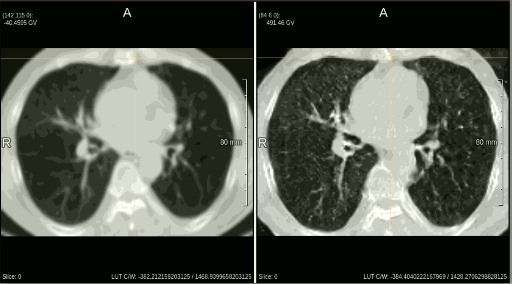

# CycleGAN-based Super Resolution of Lung nCECT Images of COPD and Lung Cancer Patients

# Introduction
This git contains code for image synthesis from low-resolution nCECT lung image to high-resolution CECT lung image using CycGAN.

# Dataset
## Training Dataset
We retrospectively collected 21 pairs of nCECT and CECT images of COPD/lung cancer patients for training, each pair is from the same patient. Note that the training is unsupervised (1 image is paired with other 20 images for training).
## Evaluation Dataset
We retrospectively collected 17 nCECT images of COPD/lung cancer patients for evaluation. The diagnostic CECT image of those patient was lost or unsaved.

# Method
This project reimplements CycleGAN for image synthesis from nCECT to CECT. The input is volumetric 3D lung CT images (nii format). 

### Environment setup
1. Install [anaconda](https://docs.anaconda.com/anaconda/install/windows/)
2. Create and setup conda environment 
``` bash
conda create --name CycleGAN_LungSR python=3.8.16
conda activate CycleGAN_LungSR
```
3. Install [PyTorch](https://pytorch.org/get-started/locally/) <br>
This source code works fine for torch version 2.0.1

### Data preprocessing and Training
1. Structure the input 3D nii image folder and processed 2D tiff image folder as follows:
```
datasets
├── lung_COPD_3D
│   ├── Patient_001
│   │   ├── p001_diag.nii.gz
│   │   ├── p001_diag_seg.nii.gz
│   │   ├── p001_spectct.nii.gz
│   │   ├── p001_spectct_seg.nii.gz
│   ├── Patient_002
│   │   ├── p002_diag.nii.gz
│   │   ├── p002_diag_seg.nii.gz
│   │   ├── p002_spectct.nii.gz
│   │   ├── p002_spectct_seg.nii.gz
|   |   ......
├── lung_COPD
│   ├── trainA (for 2D CECT tiff)
│   ├── trainB (for 2D nCECT tiff)
```
2. Refer to `data_revgan.py` to 
- Obtain lung lobes segmentation (p00x_diag_seg.nii.gz and p00x_spectct_seg.nii.gz)
- Convert 3D nii images into 2D tiff images. 

3. Command for training (please refer to `./options/base_options.py` and `./options/train_options.py` for more customization of the command)
```bash
python train.py --dataroot ./datasets/lung_COPD --name lung_COPD --model cycle_gan --which_direction BtoA --fineSize 160
```

Training results could be found in `./checkpoints/lung_COPD/web/index.html`

4. Command for inference (refer to `./options/test_options.py` for more customization of the command)
```bash
python test.py --dataroot ./datasets/lung_COPD --name lung_COPD --model cycle_gan --which_direction BtoA --fineSize 160
```
Inference results could be found in `./results/lung_COPD/test_latest/index.html`

# Results
Here are some potential visual results of the proposed method. Each row represents a test case, from left (original low-resolution nCECT) to right (super-resolution nCECT):



# Reference
The implementation of CycleGAN in this work is based on the following sources:
- [CycleGAN](https://github.com/junyanz/CycleGAN)
- [RevGAN](https://github.com/tychovdo/RevGAN/tree/master)

The lung lobes segmentation in this work is based on the following sources:
- [ResUNet](https://github.com/JoHof/lungmask)
